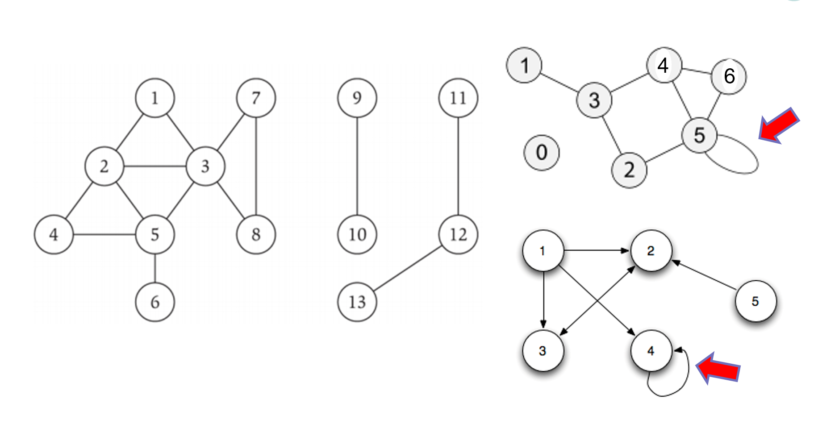
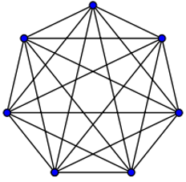

# Lecture 15 : Graphs

>Note: The most of the information of these lectures was extracted and adapted from Dr Bajuelos and from Weiss’s book, “Data Structures and Algorithm Analysis in Java". They are provided for COP3530 students only. Not to be published or publicly distributed without permission by the publisher. 


## Graphs definition

In Java, the Graph is a data structure that stores a certain of data. The concept of the graph has been stolen from the mathematics that fulfills the need of the computer science field. It represents a network that connects multiple points to each other. 

A graph consists of vertices and edges. A vertex represents the entity (e.g., people) and an edge represents the relationship between entities (e.g., a person's friendships).

## Examples:

* Networks: pipelines, roads, assignment problems

* Maps: Flight routes, animal migrations

* Representing processes: flow charts, Markov models

* Representing partial orderings: PERT charts, makefiles

* Representing connected structures as used in Git.


## Design

A graph G = <V,E> consists of a set of vertices, V, and a set of edges, E. 

Each edge is a pair (v,w), where v and w ∈ V. Edges are sometimes referred to as arcs. 

If the pair is ordered, then the graph is directed. Directed graphs are sometimes referred to as digraphs.

Vertex w is adjacent to v if and only if (v,w) ∈ E. 

In an undirected graph with edge (v,w), and hence (w,v), w is adjacent to v and v is adjacent to w. 

Sometimes an edge has a third component, known as either a weight or a cost of the edge.


## Undirected Graphs

Edges in the undirected graphs, have no specific direction i.e. edges are always “two-way”

Thus, (u,v) ∈ E  ⇒ (v,u) ∈ E 
* Only one of these edges needs to be in the set

Degree of a vertex: 
* number of edges containing that vertex  or
* number of adjacent vertices

Example:
* Degree of A is 1
* Degree of B, and C is 3


## Directed Graphs

Edges in the directed graphs (digraphs) have a direction

* (u,v) ∈ E ⇏ (v,u) ∈ E

The u is the source and v the destination
* In-degree of a vertex: edges where the vertex is the destination

* Out-degree of a vertex: edges where the vertex is the source.

Example:
* In-degree of vertex 4 is 3
* Out-degree of vertex 1 is 3
* In-degree of vertex 1 is 0 


## Graphs. Preliminary results


## Graphs. Connectedness

Loop is an edge that connects a vertex to itself i.e. (u,u).

A simple graph contains no loops.

A vertex of the graph can have a degree (in-degree or/and out-degree) equal to  zero.

A graph does not have to be connected



## Graphs. Some bounds

Let a graph G = <V,E> 

Assume that:
* \|V\| is the number of vertices
* \|E\| is the number of edges

Minimum of \|E\|?

* 0 
* 1 (if self-edges (loops) allowed) 

Maximum of \|E\| for undirected?
* (\|V|*(\|V\| -1))/2 + \|V\| ∈ O(\|V\|<sup>2</sup>)
    * (assuming self-edges allowed, else subtract \|V\|)

Maximum of \|E\| for directed?
* \|V\|<sup>2</sup>
(assuming self-edges allowed, else subtract \|V\|)




Simple graph with max number of edges


(non)Simple digraph with max number of edges

## Graphs. Path and Cycles

Let a graph G = <V,E> 

A path in the graph G is a list of vertices [v<sub>j</sub>,…,v<sub>k</sub>] such that (v<sub>i</sub>,v<sub>i+1</sub>) ∈  E for all j <= i < k. 
* Say “a path from v<sub>j</sub> to v<sub>k</sub>”

A cycle is a path that begins and ends at the same node (v<sub>j</sub> = v<sub>k</sub>).

Path length: Number of edges in a path.

Path cost: Sum of  weights of edges in a path


Path(3,4) = (3,7,6,5,1,4)

Cycle(6,6) = (6,5.1,2,6)

Len(Path(3,1) = (3,6,5,1)) = 3

Cost(Path(3,1) = (3,6,5,1)) = 5

### Graphs. Undirected-Graph Connectivity

An undirected graph is connected if for all pairs of vertices u and v there exists a path from u to v


An undirected graph is complete (or fully connected) if for all pairs of vertices u and v there exists an edge from u to v


### Strongly vs Weakly Connected

Let a graph G = <V,E> 

* A directed graph is strongly connected if there is a path from every vertex to every other vertex
* A directed graph is weakly connected if there is a path from every vertex to every other vertex ignoring direction of edges

Example:


## Trees and Graphs

Equivalent forms of the definition of a tree:

A tree is a connected graph that contains no cycles. 

A tree is a graph with exactly one path between any two vertices. 

A connected graph of n vertices is a tree iff it has n-1 edges. 

All trees are graphs, but not all graphs are trees


## Graphs. How to store them 
> ### Adjacency Matrix Representation

Let a graph G = <V,E> and assume that \|V\|=N

In the adjacency matrix representation, each graph of N nodes is represented by an N x N matrix A, that is, a two-dimensional array A

The nodes are (re)-labeled 1,2,…,n (or for 0 to n-1)
* A[i][j] = 1 if (i,j) is an edge in the graph
* A[i][j] = 0 if (i,j) is not an edge in the graph


Example:


Adjacency Matrix representation for graphs

### Graphs. Adjacency Matrix Properties

Running time to:
* Get a vertex’s out-edges: O(\|V\|)
* Get a vertex’s in-edges: O(\|V\|)
* Decide if some edge exists: O(1)
* Insert an edge:  O(1)
* Delete an edge: O(1)

Space requirements: O(\|V\|<sup>2</sup>) bits

Good representation for dense graphs*

Undirected will be symmetric around the diagonal

How can we adapt the representation for weighted graphs?
* Store a number in each cell (weight)

Dense graph is a graph in which the number of edges is close to the maximal number of edges (O(\|V\|<sup>2</sup>).

## Graphs. Adjacency List Representation

Let a graph G = <V,E> 

A graph of N vertices is represented by a one dimensional array L of linked lists, where:
* L[i] is the linked list containing all the nodes adjacent from node i. 
* The nodes in the list L[i] are in no particular order


## Graphs. Adjacency List Properties

Let a graph G = <V,E> 

Running time to:

Get all of a vertex’s out-edges: 
* O(d) where d is out-degree of vertex	 

Get all of a vertex’s in-edges:
* O(|E|) (but could keep a second adjacency list for this) 

Decide if some edge exists: 
* O(d) where d is out-degree of source

Insert an edge: 
* O(1) (unless you need to check if it’s there) 

Delete an edge:
* O(d) where d is out-degree of source 

Space requirements: O(\|V\|+\|E\|)


## Storing with Array of Edge Lists

An edge list for vertex k is a linked list that stores all nodes that are adjacent to vertex k.

There is a linked list for every vertex of the graph. 


## Comparing Storage Methods

Adjacency Matrix
* Faster to add or remove an edge
* Faster to determine if an edge exists in a graph.
* Generally better for dense graphs where |E| = O(\|V\|<sup>2</sup>)
* Storage: O(\|V\|<sup>2</sup>)
Edge Lists
* Faster to perform an operation on all nodes adjacent to a node in a sparse graph.
* Generally better for sparse graphs where \|E\| = O(\|V\|)
* Storage: O(\|V\| + \|E\|) 

# Ideal Interface

```java

public interface Graph {
    public int getNumV();
    public boolean isDirected();
    public void insert(Edge edge);
    public boolean isEdge(int source, int dest)
    public Edge getEdge(int source, int dest)
    public Iterator<Edge> edgeIterator(int source);
}

public interface Edge {
    private int dest;
    private int source;
    private double weight;
    public Edge(int s, int d)
    public Edge(int s, int d, double w)
    public int getDest()
    public int getSource()
    public double getWeight()
}
```
## Simple Implementation

```java

import java.util.ArrayList;
import java.util.List;

class Edge
{
    int source, dest;
 
    public Edge(int source, int dest)
    {
        this.source = source;
        this.dest = dest;
    }
}
 
// A class to represent a graph object
class Graph
{
    // A list of lists to represent an adjacency list
    List<List<Integer>> adjList = null;
 
    // Constructor
    Graph(List<Edge> edges, int n)
    {
        adjList = new ArrayList<>();
 
        for (int i = 0; i < n; i++) {
            adjList.add(new ArrayList<>());
        }
 
        // add edges to the undirected graph
        for (Edge edge: edges)
        {
            int src = edge.source;
            int dest = edge.dest;
 
            adjList.get(src).add(dest);
            adjList.get(dest).add(src);
        }
    }
}

```


## Class Problem

Print all Hamiltonian paths present in a graph

Given an undirected graph, print all Hamiltonian paths present in it. The Hamiltonian path in an undirected or directed graph is a path that visits each vertex exactly once.

For example, the following graph shows a Hamiltonian Path marked in red:


The idea is to use backtracking. We check if every edge starting from an unvisited vertex leads to a solution or not. As a Hamiltonian path visits each vertex exactly once, we take the help of the visited[] array in the proposed solution to process only unvisited vertices. Also, we use the path[] array to store vertices covered in the current path. If all the vertices are visited, then a Hamiltonian path exists in the graph, and we print the complete path stored in the path[] array.

```java

import java.util.ArrayList;
import java.util.Arrays;
import java.util.List;
 
// A class to store a graph edge
class Edge
{
    int source, dest;
 
    public Edge(int source, int dest)
    {
        this.source = source;
        this.dest = dest;
    }
}
 
// A class to represent a graph object
class Graph
{
    // A list of lists to represent an adjacency list
    List<List<Integer>> adjList = null;
 
    // Constructor
    Graph(List<Edge> edges, int n)
    {
        adjList = new ArrayList<>();
 
        for (int i = 0; i < n; i++) {
            adjList.add(new ArrayList<>());
        }
 
        // add edges to the undirected graph
        for (Edge edge: edges)
        {
            int src = edge.source;
            int dest = edge.dest;
 
            adjList.get(src).add(dest);
            adjList.get(dest).add(src);
        }
    }
}
 
class Main
{
    public static void hamiltonianPaths(Graph graph, int v, boolean[] visited,
                                            List<Integer> path, int n)
    {
        // if all the vertices are visited, then the Hamiltonian path exists
        if (path.size() == n)
        {
            // print the Hamiltonian path
            System.out.println(path);
            return;
        }
 
        // Check if every edge starting from vertex `v` leads
        // to a solution or not
        for (int w: graph.adjList.get(v))
        {
            // process only unvisited vertices as the Hamiltonian
            // path visit each vertex exactly once
            if (!visited[w])
            {
                visited[w] = true;
                path.add(w);
 
                // check if adding vertex `w` to the path leads
                // to the solution or not
                
                //TODO
 
                // backtrack
                
                //TODO
            }
        }
    }
 
    public static void findHamiltonianPaths(Graph graph, int n)
    {
        // start with every node
        for (int start = 0; start < n; start++)
        {
            // add starting node to the path
            List<Integer> path = new ArrayList<>();
            path.add(start);
 
            // mark the start node as visited
            boolean[] visited = new boolean[n];
            visited[start] = true;
 
            hamiltonianPaths(graph, start, visited, path, n);
        }
    }
 
    public static void main(String[] args)
    {
        // consider a complete graph having 4 vertices
        List<Edge> edges = Arrays.asList(
                new Edge(0, 1), new Edge(0, 2), new Edge(0, 3),
                new Edge(1, 2), new Edge(1, 3), new Edge(2, 3)
        );
 
        // total number of nodes in the graph (labelled from 0 to 3)
        int n = 4;
 
        // build a graph from the given edges
        Graph graph = new Graph(edges, n);
 
        findHamiltonianPaths(graph, n);
    }
}
```
